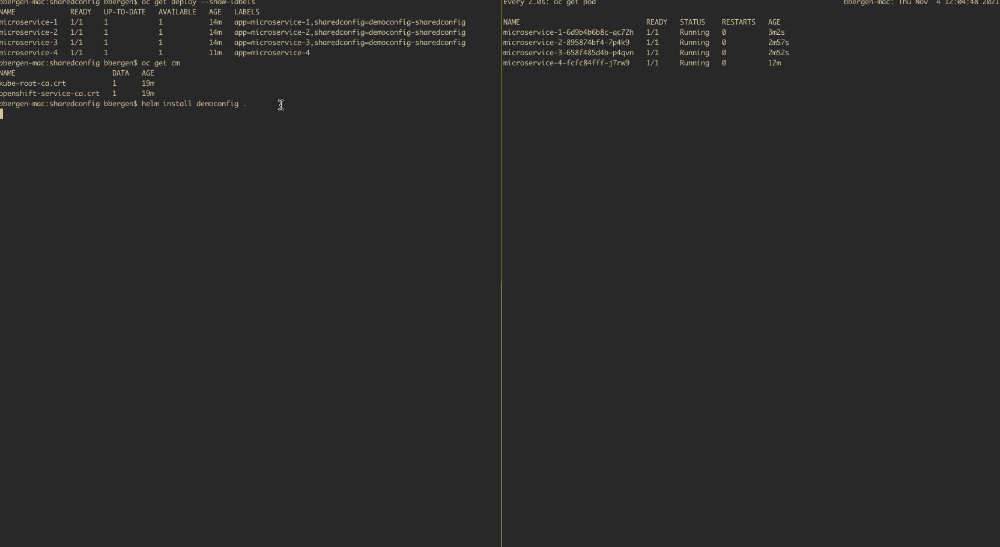

# Helm SharedConfig POC

This repo is a proof of concept on how to use [Helm Hooks]() to have a shared ConfigMap and re-issue `oc rollout restart` commands for all resources that use the config.

## Demo

